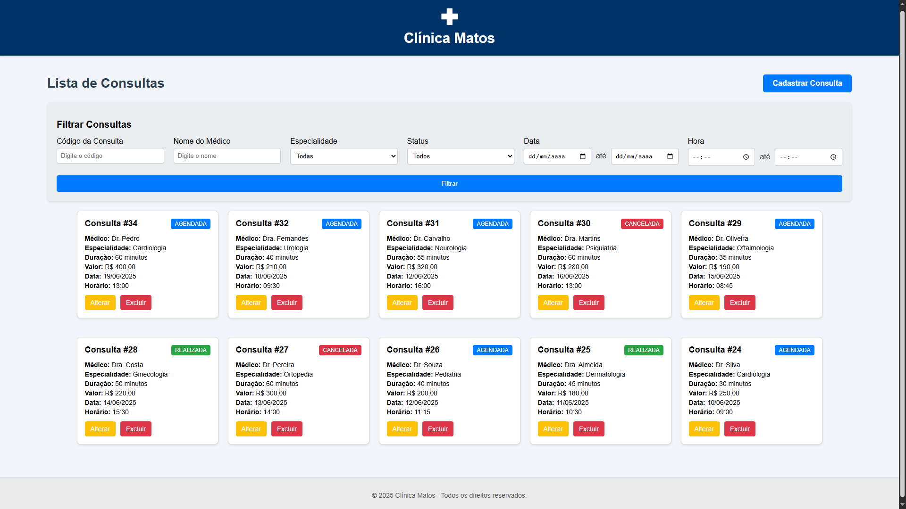
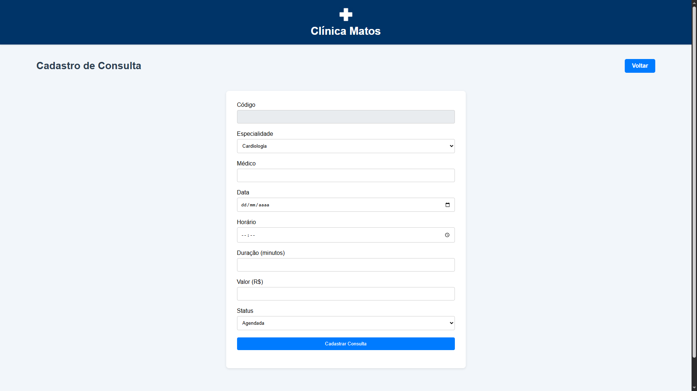

# 🩺 Sistema de Consultas Médicas

Este é um sistema web simples para gerenciamento de consultas médicas, desenvolvido como projeto acadêmico utilizando **PHP**, **HTML**, **CSS** e **MySQL**. O projeto segue o padrão de arquitetura **MVC** e utiliza os design patterns **DAO** (Data Access Object) e **Connection Factory** para organização e desacoplamento do código.

## 🚀 Funcionalidades

- ✅ Cadastro de novas consultas
- ✏️ Edição de consultas existentes
- ❌ Exclusão de consultas
- 📋 Visualização de todas as consultas em tabela
- 🔍 Filtros avançados por:
  - Código da consulta
  - Nome do médico
  - Especialidade
  - Status da consulta
  - Intervalo de data
  - Intervalo de hora

## 🛠️ Tecnologias Utilizadas

- **Back-end:** PHP
- **Front-end:** HTML, CSS
- **Banco de Dados:** MySQL
- **Padrões de Projeto:** DAO e Connection Factory
- **Arquitetura:** MVC (Model-View-Controller)

## 🧱 Estrutura do Projeto

```
index.php                       -> Rotas do sistema

/model
│   ├── ConnectionFactory.php   -> Classe de conexão com o banco de dados
│   ├── Consulta.php            -> Entidade Consulta
│   └── ConsultaDAO.php         -> DAO da entidade Consulta

/controller
│   └── ConsultaController.php  -> Lógica de controle da aplicação

/view
│   ├── 
│   ├── /pages/                 -> Páginas específicas (home, cadastro etc)
│   └── /components/            -> Componentes reutilizáveis (header, footer etc)

/sql
│   └── banco.sql               -> Script SQL para criar e popular o banco de dados

/screenshots                    -> Imagens do sistema (prints de tela)
```

## ⚙️ Como Executar o Projeto

1. Clone este repositório:
   ```bash
   git clone https://github.com/seu-usuario/nome-do-repositorio.git
   ```

2. Importe o banco de dados:
   - Crie um banco no MySQL (ex: `sistema_consultas`)
   - Importe o arquivo `tabela_consulta.sql` (se disponível neste repositório)

3. Configure o arquivo de conexão:
   - Edite `/model/database.php` com seus dados de acesso ao banco (host, usuário, senha e nome do banco)

4. Coloque o projeto em um servidor local (ex: XAMPP, WAMP ou Laragon)

5. Acesse via navegador:
   ```
   http://localhost/nome-do-repositorio/
   ```

## 📸 Demonstração

Você pode ver abaixo as telas do sistema em funcionamento:

<p align="center">
  
</p>

<p align="center">
  
</p>

## 📚 Aprendizados

Durante o desenvolvimento deste sistema, aprendi na prática como:

- Utilizar a arquitetura MVC para separar responsabilidades
- Aplicar os padrões DAO e Connection Factory para melhorar a organização do código
- Criar filtros de pesquisa em SQL com múltiplos critérios
- Montar uma aplicação CRUD completa com PHP e MySQL
- Desenvolver uma interface funcional com HTML e CSS simples

## 🤝 Contribuições

Este é um projeto acadêmico, mas estou aberto a sugestões, melhorias ou feedbacks. Sinta-se à vontade para abrir uma issue ou enviar um pull request!

---

📌 **Licença:** Este projeto é de uso educacional. Livre para estudo e aprendizado.
